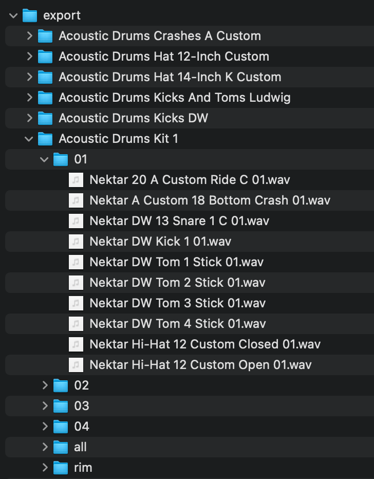

# Bitwig Drum Machine Presets Exporter

Takes the Bitwig Drum Machine (container) presets and exports the sample WAVs to velocity specific folders for use on the Digitakt or another sampler. 
The presets are exported to an `export` directory in the same directory that the executable is run. The primary motivation for writing this was to 
segment the acoustic drum samples in Bitwig into more useable folder for transfer to my Digitakt. If you copy over all the the raw sample, you're 
going to end up using most of your +Drive. This allows you to easily copy a set of samples at a specific velocity level over to the Digitakt and 
use WAY less space.

**Note:** Right now this will ONLY export the Nektar Acoustic Drum samples as those are what I immediately wanted. I plan to add support for other 
sample based presets

I wanted to put this out here because I'm sure someone else is in a similar situation to myself. If you need support for another operating system 
and are willing to test it, I'm happy to an update in to support Windows/Linux, just open an issue. I'll get to it when I have some free time. 
I just don't run Bitwig on either of those platforms right now, hence the initial Mac support :sunglasses:.

## Example

## Caveats

- Rimshots are sent to a separate folder
- In the cymbal only exports, the groups are a little weird because of slightly different naming.

## Support

The exporter supports MacOS installations at the default installation path.

## TODO

- Add support for the Drum Machine Presets
- Maybe reorganize the export folder structure.

